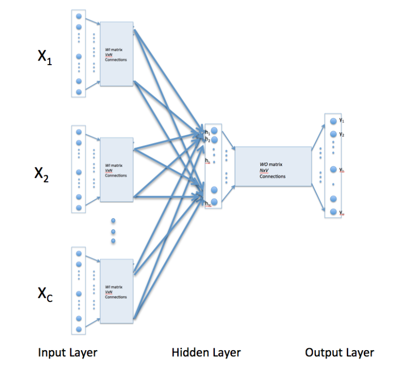
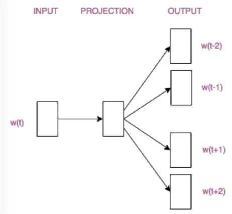
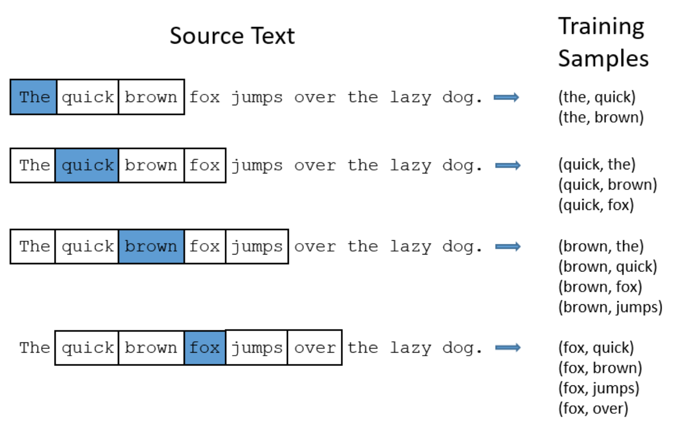
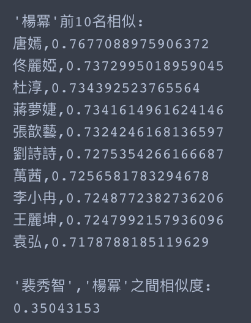
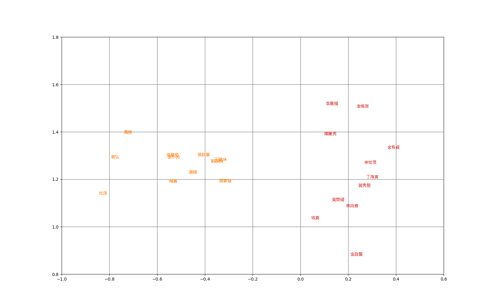

# WORD2VECTOR
 
## 什麼是Word2vec？
 
Word2vec 是 Word Embedding 方式之一是屬於非監督式學習(Unsupervised Learning), 主要方法可以分為 CBOW(Continuous Bag Of Words) 及 Skip-gram 兩種模型。是將詞轉化為「可計算」「結構化」的向量的過程。簡而言之就是將每一個字轉換成一條向量，並讓這字的語意透過這條向量描繪出來。早期做自然語言處理時，很難對讓電腦對詞背後的意思有更深一層的理解(One-hot encoding method)，因此詞與詞之間的關係很難被挖掘出來，像是相似詞、相反詞、對應詞等，因此Word2Vec在這樣的背景下產生，word2vec 計算的是餘弦值 (cosine)，距離範圍為 0–1 之間，值越大代表兩個詞關聯度越高。
## Word2Vector 特點

* 可以很簡單的算出詞彙間的相似性(向量計算)
* 比起one-hot的方式，具有詞彙與詞彙間語意的關係
* 可用於降維表示詞彙
* 單詞間的線性規則（國王+女人=女王）
* 但需要花費時間訓練大量的文章


## Skip-gram & CBOW(Continuous Bag of Words)

首先說下CBOW的三層結構：輸入層，投影層（中間層），輸出層，假設語料庫的詞有詞: 【裴秀智，和，今天，明天，在，首爾，拍攝，我，戲劇，綜藝節目】
現在有這樣一句話：明天在首爾翡秀智和我拍攝戲劇
很顯然，對這個句子分詞後應該是：
[明天 在 首爾 裴秀智 和 我 拍攝 戲劇]
而取裴秀智的前三後三個向量
輸入向量為:
```
明天: [0, 0, 0, 1, 0, 0, 0, 0, 0, 0, ]
在: [0, 0, 0, 0, 1, 0, 0, 0, 0, 0, ]
首爾: [0, 0, 0, 0, 0, 1, 0, 0, 0, 0, ]
和: [0, 1, 0, 0, 0, 0, 0, 0, 0, 0, ]
我: [0, 0, 0, 0, 0, 0, 0, 1, 0, 0, ]
拍攝: [0, 0, 0, 0, 0, 0, 1, 0, 0, 0, ]
```
而裴秀智的向量是:
```
裴秀智: [1, 0, 0, 0, 0, 0, 0, 0, 0, 0, ]
```
將這幾個向量求和
```
X = [0, 1, 0, 1, 1, 1, 1, 1, 0, 0, ]
```
則X就是輸入層，即輸入層是由裴秀智的前後三個詞生成的一個向量，為1*10維（這裡的10是語料庫中詞語的個數）

我們這裡是根據一個詞語的上下文來預測這個詞究竟是哪個，這個例子中就是根據裴秀智這個詞的前後三個詞來預測裴秀智這個位置出現各個詞的概率，因為訓練數據中這個詞就是裴秀智，所以裴秀智出現的概率應該是最大的， 所以我們希望輸出層的結果就是裴秀智對應的向量

所以本例中，輸出層期望的數據實際就是裴秀智這個詞構成的向量(可以認為是訓練數據的標籤) 即：
```
裴秀智: [1, 0, 0, 0, 0, 0, 0, 0, 0, 0, ]
```
CBOW類神經網路的結構就是:


最終的輸出層的尺寸1 * 10 =（1 * 10）*（10 * m）*（m * 10）
m為隱藏層的大小
實際輸出就是根據輸入X以及兩個參數矩陣w和b計算後輸入到softmax函數所得的結果：

即將X * w * b的值輸入到softmax函數得到實際的輸出
```
Y =  [y1, y2, y3, y4, y5, y6, y7, y8, y9, y10]
Y_ = [1, 0, 0, 0, 0, 0, 0, 0, 0, 0] 
裴秀智: [1, 0, 0, 0, 0, 0, 0, 0, 0, 0]
```
loss fuction為:
```
J(θ) = (y1-0)*(y1-0) +  (y2-0)*(y2-0) +  (y3-0)*(y3-0) +  (y4-0)*(y4-0) +  (y5-1)*(y5-1) +  (y6-0)*(y6-0) +  (y7-0)*(y7-0) +  (y8-0)*(y8-0) +  (y9-0)*(y9-0) +  (y10-0)*(y10-0) 
```

採用梯度下降法來不斷調整w和b的值（即不斷給w和b的參數值一個增量），當模型的輸出滿足某個設定的條件時，則停止訓練
注意：模型輸出的結果不會剛好就是一個one-hot向量，可以認為趨近於0的就是0，趨近於1的就是1，當然為1的肯定只有一個元素，為了加快訓練速度，可以一個附加在一起訓練，將多個句子的損失函數求和來訓練。

最終訓練結束後，就要將一個詞表示成一個向量，那麼怎麼表示呢？

輸入X中第一個元素的梯度1，這表示的其實就是“今天”這個詞，那麼“今天”就用它對應的連線上的權重參數來表示
```
明天 =  [w11, w12... w1m]
在   =  [w21, w22... w2m]
首爾 =  [w31, w32... w3m]
裴秀智 =  [w41, w42... w4m]
```
理解CBOW後，而Skip-gram模型就非常簡單了，CBOW模型是用詞的前後幾個詞來預測這個詞，而Skip-gram模型則是用一個詞來預測他周圍的詞則架構圖為下。


圖還是跟CBOW畫的那個圖相似的，只不過輸入X不是那幾個詞的向量和了，而是“裴秀智”對應的向量。簡單來講Skip-gram 是利用中心詞來預測上下文，假定「裴秀智」為模型的輸入，則輸出為固定 window 長度3的上下文詞彙，如「明天 」、「在 」、「首爾」、「和」、「我」、「拍攝」。

skip-gram input samples:



## WORD2VECTOR tool

講到word2vetor的工具，一定是先使用gemsim，這個函式庫包含了許多NLP的方法可以使用，而也包裝了word2vector常用的兩種方法，至於怎麼使用可以參考reference，而以下的結果圖，就是針對韓國明星和中國明星使用CBOW建出來的並使用PCA將embedding降為2維的空間圖。
## 基於維基百科的中韓明星mbedding



## Reference

* [word2vec-with-gensim](http://zake7749.github.io/2016/08/28/word2vec-with-gensim/)
* [tensorflow-word2vector](https://mofanpy.com/tutorials/machine-learning/nlp/cbow/)
